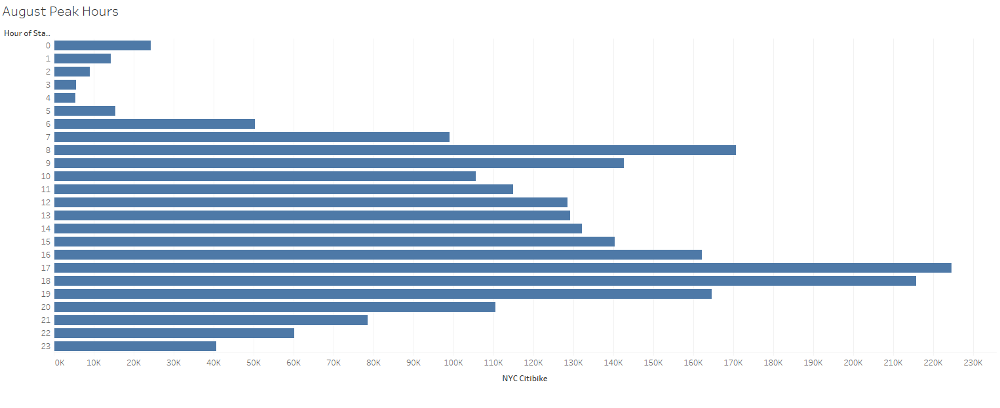
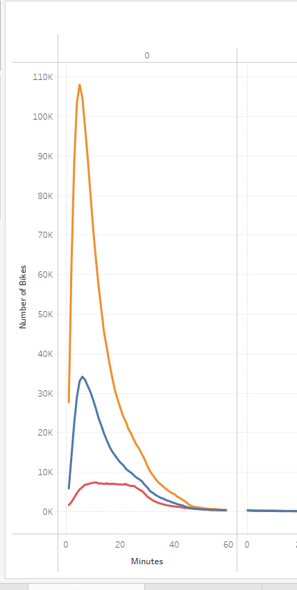
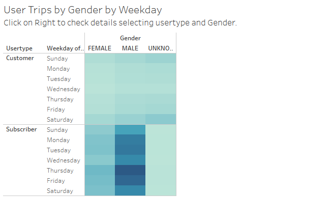
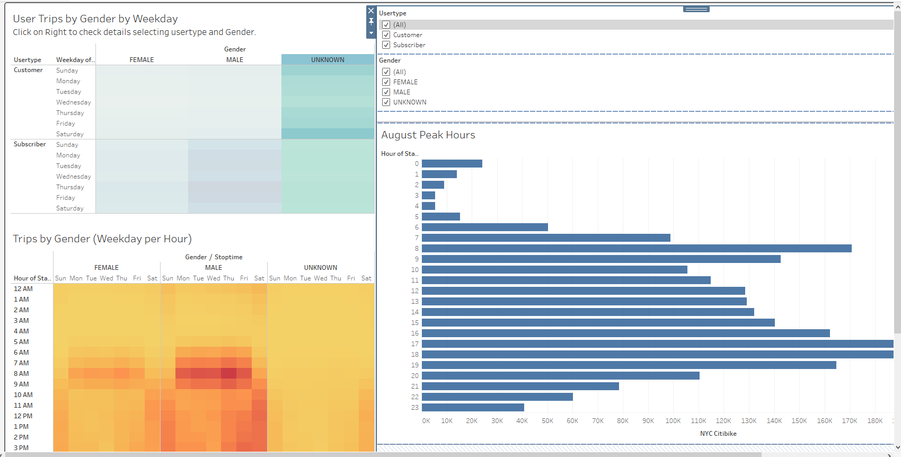

# NYC CitiBike Visualization

## Overview:

The client has requested a visualization of the data to analyze so they can convince investors that a bike-sharing program in Des Moines is a solid business proposal. 

### Part of the request is to create visualizations to:

Show the length of time that bikes are checked out for all riders and genders.
Show the number of bike trips for all riders and genders for each hour of each day of the week.
Show the number of bike trips for each type of user and gender for each day of the week.

## Results:

August Peak hours shows that 7 AM to 8 PM is where the bikes are more used and 8 AM to 9 AM & 4 PM to 8 PM is the peak.
This visualization also helps with deciding when the repairs can be made on the bikes that needs it and the best time would be 1 AM to 4 AM.

This visualization tells us that there are more male than females who ride the bikes.

Looking at this visualization we can tell the subscriber ride more than an average customer.

By creating a dashboard and having all the visualization on one page and creating a filter the customer can dig deeper on the details by Gender, User type and Hours.

## Summary
By using the above shown visualizations, it can be determined that Des Moines could use a bike sharing program in their high trafficked areas. The main goal would have to find areas around the city that would be best enjoyed while riding a bike. Create tour routes with points of interests in order to influence potential users to become riders. Based on the visualizations, male enjoy shorter trips while females cruise for a longer time. Also, create a subscriber program with additional benefits and discounts to encourage users to join. Weekends tend to be high usage days and repairs should be made prior to the weekends and during nighttime.

Click on the [Link to Tableau Visualization](ttps://public.tableau.com/app/profile/hira.ayub/viz/CitiBike_16213859476590/NYCCitiBike)
